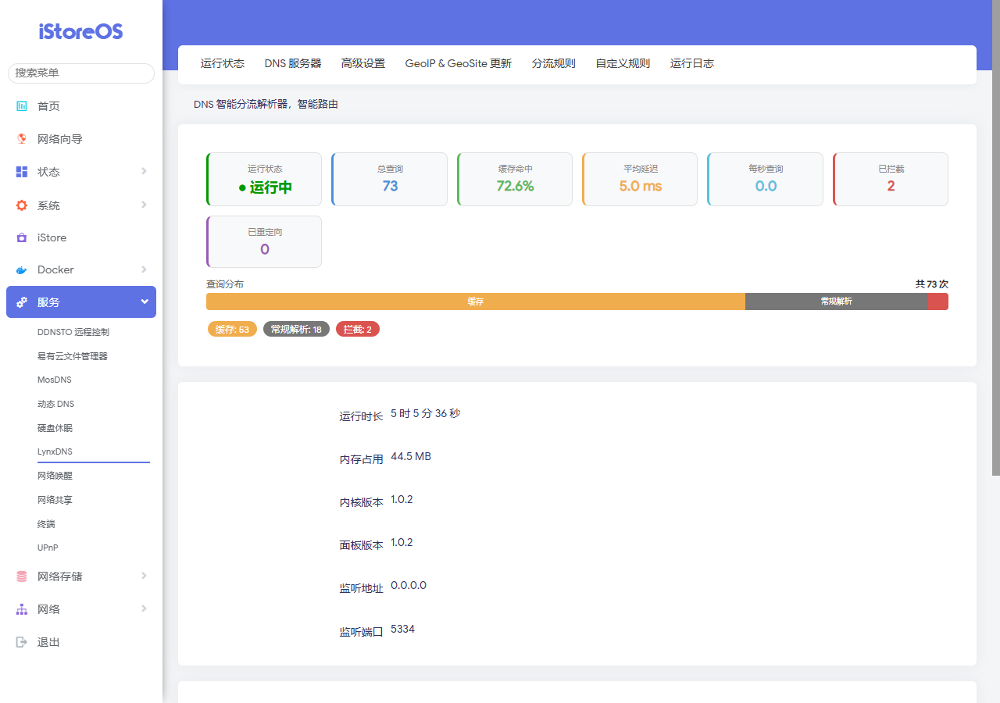
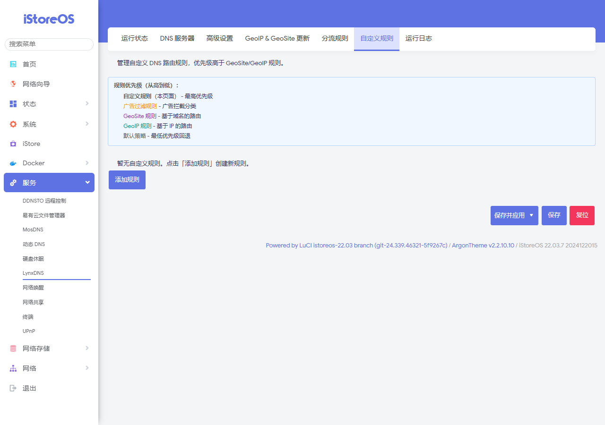
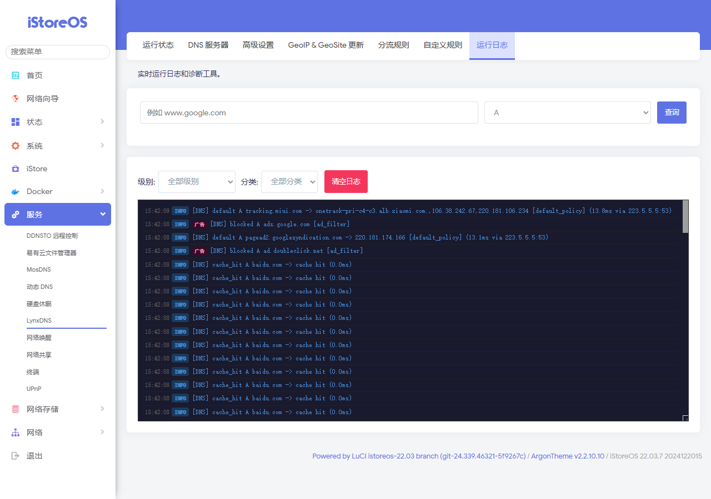

<div align="center">

# 🐱 LynxDNS

**一个为 OpenWrt 打造的智能 DNS 分流器**

[](https://go.dev)
[](LICENSE)
[](https://openwrt.org)

高性能 · 易配置 · 全中文界面

</div>

---

## ✨ 特性

- 🚀 **高性能查询** - 本地域名平均延迟 7.6ms，缓存命中 < 1ms
- 🌐 **智能分流** - 基于 GeoSite/GeoIP 自动识别本地/远程域名，分别转发
- 🛡️ **广告过滤** - 内置 AdGuard DNS Filter 规则，自动更新
- 🔒 **DNS 泄漏保护** - 严格/标准/宽松三种模式，防止 DNS 泄露
- 📊 **实时监控** - WebSocket 实时推送 DNS 查询日志，彩色高亮
- 🎛️ **LuCI Web 界面** - 全中文管理界面，可视化配置
- 📝 **自定义规则** - 支持精确/后缀/通配符/正则/关键字 5 种匹配模式
- 🔄 **配置热更新** - 修改配置无需重启服务
- 📦 **一键安装** - 支持 x86_64、aarch64、arm、mips 等多架构
- 🌍 **多协议支持** - UDP、TCP、DNS-over-TLS (DoT)、DNS-over-HTTPS (DoH)

---

## 📸 截图

| 概览 | DNS 配置 |
|:---:|:---:|
|  |  |

| 分流规则 | 实时日志 |
|:---:|:---:|
|  |  |

---

## 🚀 快速安装

### 一键安装（推荐）

下载安装包，通过 iStoreOS/OpenWrt 的离线安装页面上传，或通过 SSH 执行：

```bash
# 下载安装包
wget https://github.com/lemonzhai/LynxDNS/releases/latest/download/lynxdns_1.0.3_x86_64_luci.run

# 执行安装（自动检测架构）
sh lynxdns_1.0.3_x86_64_luci.run
```

安装完成后，访问 `http://路由器IP/cgi-bin/luci/admin/services/lynxdns` 即可使用。

### 支持架构

安装包内置以下 8 种架构二进制，安装时自动检测：

| 架构 | 适用设备 |
|------|---------|
| x86_64 | x86 软路由、虚拟机 |
| aarch64 | NanoPi R4S/R2S、树莓派 4 |
| armv7 | ARMv7 路由器 |
| arm | ARM v5 路由器 |
| mipsel-softfloat | 小米路由 3G、Newifi D2、K2P |
| mipsel-hardfloat | MIPS 小端硬浮点设备 |
| mips-softfloat | 老旧 Broadcom/Atheros 设备 |
| mips-hardfloat | MIPS 大端硬浮点设备 |

### 安装参数

```bash
sh lynxdns_*.run                  # 自动检测架构安装
sh lynxdns_*.run --arch aarch64   # 指定架构
sh lynxdns_*.run --extract        # 仅解压不安装
sh lynxdns_*.run --help           # 查看帮助
```

### 手动安装

```bash
# 1. 复制二进制
cp lynxdns-core/bin/lynxdns-x86_64 /etc/lynxdns/lynxdns
chmod +x /etc/lynxdns/lynxdns

# 2. 复制配置和数据
cp lynxdns-core/config.yaml /etc/lynxdns/
cp -r lynxdns-core/data/ /etc/lynxdns/data/

# 3. 复制 LuCI 界面文件
cp -r luci-app-lynxdns/htdocs/* /www/
cp luci-app-lynxdns/luasrc/controller/lynxdns.lua /usr/lib/lua/luci/controller/
cp -r luci-app-lynxdns/root/* /

# 4. 启动服务
/etc/init.d/lynxdns enable
/etc/init.d/lynxdns start
```

---

## 📖 使用说明

### 首次配置

安装后，LynxDNS 使用以下默认配置：

| 配置项 | 默认值 |
|--------|--------|
| DNS 监听 | `0.0.0.0:5334` (UDP/TCP) |
| API 监听 | `127.0.0.1:5335` |
| 本地 DNS | `223.5.5.5:53`, `119.29.29.29:53` |
| 远程 DNS | `8.8.8.8:853` (DoT) |
| 缓存大小 | 4096 条 |
| 懒缓存 | 启用 |
| 广告过滤 | 启用 |
| 泄漏保护 | 启用 (宽松模式) |

### DNS 分流逻辑

```
DNS 请求
  │
  ├── 自定义规则匹配 ──→ 拦截 / 重定向 / 本地DNS / 远程DNS
  │
  ├── 广告过滤匹配 ──→ 拦截 (返回空响应)
  │
  ├── GeoSite 匹配 ──→ 本地DNS (cn) / 远程DNS (geolocation-!cn)
  │
  ├── 泄漏保护 ──→ 根据模式处理
  │
  └── 默认策略 ──→ 本地DNS / 远程DNS
```

### 自定义规则

支持 5 种域名匹配模式：

| 模式 | 示例 | 说明 |
|------|------|------|
| 精确匹配 | `example.com` | 完全匹配域名 |
| 后缀匹配 | `.example.com` | 匹配所有子域名 |
| 通配符 | `*.example.com` | 匹配所有子域名 |
| 正则表达式 | `regexp:ad\d+\.com` | 使用正则表达式 |
| 关键字 | `keyword:adservice` | 包含关键字的域名 |

---

## 🏗️ 项目结构

```
LynxDNS/
├── luci-app-lynxdns/           # LuCI Web 管理界面
│   ├── htdocs/                 # 前端静态资源 (JS/CSS)
│   │   ├── luci-static/
│   │   │   ├── lynxdns.css     # 全局样式
│   │   │   └── resources/view/lynxdns/
│   │   │       ├── overview.js # 概览页
│   │   │       ├── dns.js      # DNS 配置
│   │   │       ├── rules.js    # 分流规则
│   │   │       ├── routing.js  # 路由配置
│   │   │       ├── geo.js      # Geo 数据管理
│   │   │       ├── advanced.js # 高级设置
│   │   │       └── logs.js     # 实时日志
│   ├── luasrc/
│   │   └── controller/
│   │       └── lynxdns.lua     # LuCI 后端控制器
│   └── root/
│       └── etc/
│           ├── config/         # UCI 配置
│           ├── init.d/         # 服务脚本
│           └── uci-defaults/   # 首次启动脚本
│
└── lynxdns-core/               # DNS 核心引擎 (Go)
    ├── cmd/lynxdns/
    │   └── main.go             # 入口
    ├── internal/
    │   ├── api/                # RESTful API + WebSocket
    │   ├── cache/              # LRU 缓存引擎
    │   ├── client/             # DNS 客户端 (UDP/TCP/DoT/DoH)
    │   ├── config/             # 配置管理
    │   ├── geodata/            # GeoSite/GeoIP/AdFilter 数据
    │   ├── log/                # 彩色日志
    │   ├── resolver/           # 核心解析路由
    │   ├── rules/              # 自定义规则引擎
    │   ├── server/             # DNS 服务器
    │   └── updater/            # 数据自动更新
    ├── configs/
    │   └── config.yaml         # 默认配置
    └── data/                   # Geo 数据文件
```

---

## ⚙️ 配置示例

```yaml
server:
  enabled: true
  listen_addr: "0.0.0.0"
  listen_port: 5334

api:
  addr: "127.0.0.1"
  port: 5335

dns:
  domestic:
    - "udp://223.5.5.5:53"
    - "udp://119.29.29.29:53"
  remote:
    - "tls://8.8.8.8:853"
  default: domestic
  bootstrap:
    - "udp://223.5.5.5:53"

advanced:
  concurrency: 3
  cache:
    enabled: true
    size: 4096
    lazy: true
  leak_protection:
    enabled: true
    mode: loose
  ad_filter:
    enabled: true

routing:
  geosite:
    remote:
      - "geolocation-!cn"
      - "google"
      - "github"
    domestic:
      - "cn"
    ad_filter:
      - "category-ads-all"

geo:
  auto_update: true
  update_cron: "0 3 * * *"
  geosite_url: "https://github.com/Loyalsoldier/v2ray-rules-dat/releases/latest/download/geosite.dat"
  geoip_url: "https://github.com/Loyalsoldier/geoip/releases/latest/download/geoip.dat"
  ad_filter_url: "https://adguardteam.github.io/AdGuardSDNSFilter/Filters/filter.txt"
```

---

## 📊 性能

在 iStoreOS 22.03 (x86_64) 上的实测数据：

| 指标 | LynxDNS |
|------|---------|
| 本地域名平均延迟 | ~7.6ms |
| 远程域名平均延迟 | ~7.1ms |
| 缓存命中延迟 | ~0.65ms |
| 内存占用 | ~78MB |
| 二进制大小 | ~9MB |

---

## 🔧 编译

```bash
cd lynxdns-core

# 编译 x86_64
GOOS=linux GOARCH=amd64 go build -ldflags="-s -w" -o lynxdns-x86_64 ./cmd/lynxdns/

# 编译 aarch64
GOOS=linux GOARCH=arm64 go build -ldflags="-s -w" -o lynxdns-aarch64 ./cmd/lynxdns/

# 编译 mipsel
GOOS=linux GOARCH=mipsle GOMIPS=softfloat go build -ldflags="-s -w" -o lynxdns-mipsel-softfloat ./cmd/lynxdns/
```

---

## 🤝 致谢

- [mosdns](https://github.com/IrineSistiana/mosdns) - 优秀的 DNS 转发器，本项目的灵感来源之一
- [Loyalsoldier/v2ray-rules-dat](https://github.com/Loyalsoldier/v2ray-rules-dat) - GeoSite/GeoIP 数据
- [AdGuard SDNS Filter](https://github.com/AdguardTeam/AdguardSDNSFilter) - 广告过滤规则
- [miekg/dns](https://github.com/miekg/dns) - Go DNS 库

---

##  声明
 Go 语言和网络编程的开源实践项目，仅用于技术学习与交流。

- 本项目基于 [MIT License](LICENSE) 开源，代码仅供学习参考
- 本项目提供的 DNS 分流功能是标准的网络技术服务，用户应确保在所在地区法律法规允许的范围内合法使用
- 因使用不当或违反当地法律法规所产生的任何后果，由使用者自行承担，与项目作者无关
- 如果本项目侵犯了您的合法权益，请通过 Issue 联系，将及时处理

---

##  License

[MIT License](LICENSE)
